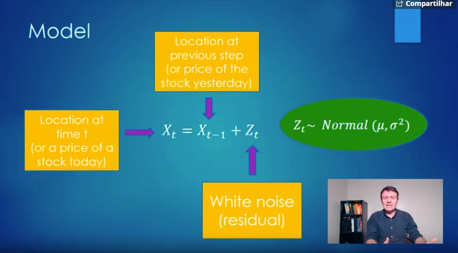
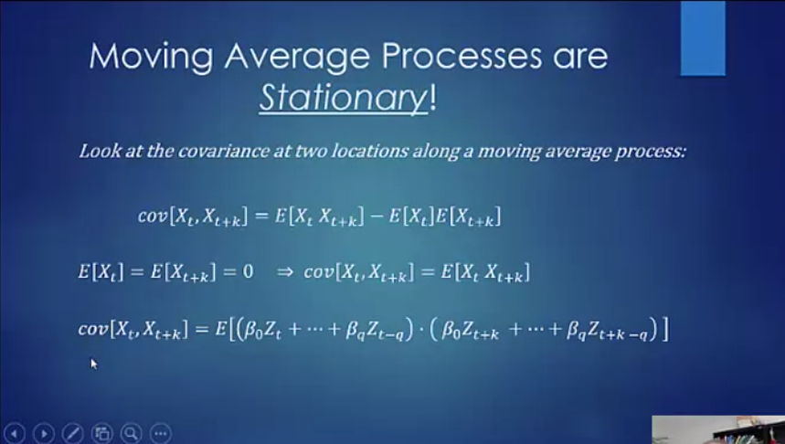
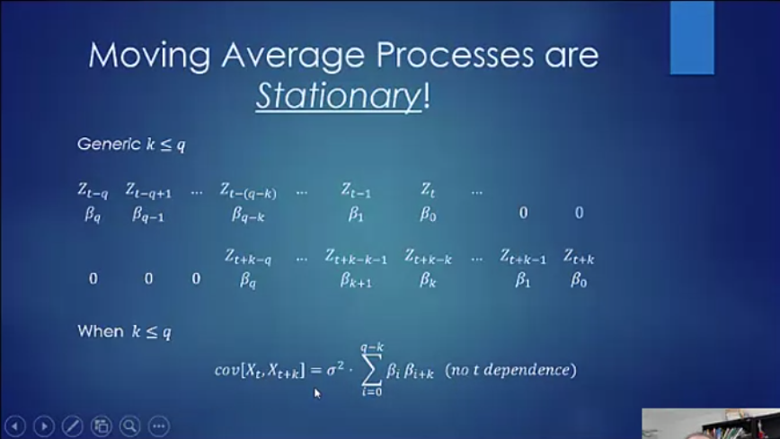

```{r setup, include=FALSE}
knitr::opts_chunk$set(echo = TRUE)
```

### Histogram
```{r}
small.size.dataset=c(91,49,76,112,97,42,70, 100, 8, 112, 95, 90, 78, 62, 56, 94, 65, 58, 109, 70, 109, 91, 71, 76, 68, 62, 134, 57, 83, 66)
hist(small.size.dataset, col='red', breaks=10, fre=F)
lines(density(small.size.dataset), lwd=2, col='purple')
```

### Scatterplot 

```{r}
set.seed=2016
Test_1_scores=round(rnorm(50,78,10))
Test_2_scores=round(rnorm(50,78,10))
plot(Test_1_scores, Test_2_scores)
```

### Time Series

```{r}
library(astsa)

```
## Weak Stationary Series

Be stationary implies that the series will not have systematic change in the mean, e.g, no trends. No systematic change in variation.

The properties of one sections of the data are much like the properties of the other sections of the data.

## Autocovariance Functions

### Covariance

If X and Y are two random variables, covariance emasures the linear dependence between two random variables
\begin{equation}
Cov(X,Y) = E[(X-E[X])(Y-E[Y])] = E[XY]-E[X]E[Y]
\end{equation}

### Autocovariance Function

\begin{gather*}
\gamma(s,t) = Cov(X_s, X_t) \\
\gamma(t,t) = Var(X_t)\\
\gamma_k = \gamma(t, t+k) \approx c_k
\end{gather*}

### Autocovariance Coefficients

\begin{equation}
c_k = \frac{\sum_{t=1}^{N-k}(x_t-\bar{x})(x_{t+k}-\bar{x})}{N}
\end{equation}

in R we use the ```acf(time_series, type='covariance')``` command.

```{r}
purely_random_process = ts(rnorm(100))
(acf(purely_random_process, type='covariance'))
# The brackets suround the function is used to print the values and not just the plot
```

### Autocorrelation Function

We assume weak stationary
The autocorrelation coefficient between $X_t$ and $X_{t+k}$ is defined to be:

$$-1 \leq \rho_k = \frac{\gamma_k}{\gamma_0} \leq 1$$

The estimation of $\rho_k$ is $r_k = \frac{c_k}{c_0}$

$r_0 = \frac{c_0}{c_0} = 1$

Example:
```{r}
(acf(purely_random_process))
```

### Random Walk



Example:
```{r}
x = NULL
x[1] = 0
for(i in 2:1000){
  x[i] = x[i-1] + rnorm(1)
}
random_walk=ts(x)
plot(random_walk, main="Random Walk", xlab='Days')
```

As we can see, the random walk process is not stationary.

### Removing Trend
\begin{equation}
X_t = X_{t-1} + Z_t \\
X_t - X_{t-1} = Z_t \\
\nabla Z_t = Z_t \text{is a purely random process}\\

\end{equation}

```{r}
plot(diff(random_walk))
acf(diff(random_walk))
```


### Moving Average Process

#### Simulating a MA(2) process

\begin{gather*}
X_t = Z_t +\theta_1Z_{t-1} + \theta_2Z_{t-2} \\
Z_i \approx Normal(\mu, \sigma^2)\\
Z_i are i.i.d
\end{gather*}

Ex:
\begin{gather*}
X_t = Z_t + 0.7Z_{t-1} + 0.2Z_{t-2}\\
Z_t \approx Normal(0,1)
\end{gather*}

```{r}
noise = rnorm(10000)
ma_2 = NULL

for(i in 3:10000){
  ma_2[i] = noise[i] + .7*noise[i-1] + .2*noise[i-2]
}
moving_average_process = ma_2[3:10000]
moving_average_process = ts(moving_average_process)

par(mfrow=c(2,1))
plot(moving_average_process, main="A moving average process of order 2")
acf(moving_average_process, main="Corellogram of a moving average process of order 2")
```

### Stationarity

There are two kinds of stationarity, strictly stationarity and weakly stationarity.

Strictly Stationarity implies that the joint distribution of random variables at time t will be equal to the joint distribution at time t+k. Perhaps, is very difficult to obtain the joint distribution of the rnadom variables, beacause sometimes the time series can have infinite random variables.

Weakly Stationarity: Just assumes that the mean and the variance will still the same for each random variable.

#### White Noise (is Stationary)

Consider a sequence of random variables: $X_t \approx iid N(0,\sigma^2)$ 

The ACF:

$\gamma(t_1,t_2)=\begin{cases}
0 \ \ \ t_1=t_2\\
t_1 \neq t_2
\end{cases}$

#### Random Walks are not Stationary

\begin{gather*}
X_t \sim \mathcal{N}(\mu, \sigma^2)\\
X_1 = Z_1 \\
X_2 = X_1 + Z_2 = Z_1 + Z_2\\
X_t = X_{t-1} + Z_t \\
X_t = \sum_{i=1}^{t}Z_i\\ 
\end{gather*}

So,

\begin{gather*}
E[X_t] = E[\sum_{i=1}^{t}Z_i] =\sum_{i=1}^{t}E[Z_i] = t \cdot \mu \\ 
V[X_t] = V[\sum_{i=1}^{t}Z_i] =\sum_{i=1}^{t}V[Z_i] = t \cdot \sigma^2 \\ 
\end{gather*}

* The operation with variance can be done because the variables are independent.

#### Moving Average Processes are Stationary

Start with IID random variables: $Z_t \sim iid(0, \sigma^2)$

MA(q) process: $X_t=\beta_0Z_t + \beta_1Z_{t-1}+...+\beta_qZ_{t-1}$




This image above is very effective, because, if we have a MA(q) process $k\leqq$ we can calculate de $Cov[X_t, X_t+k]$ by
$\sum_{i=0}^{q-k}\beta_i\beta_{i+k} = \gamma(k)$

### Backshift Operator

Let $X_1,X_2,X_3....$ be a sequence of random variables, the backshift operator $B$ returns the previous state

$$BX_t = X_{t-1}$$
\begin{gather}
B^2X_t = BBX_t = BX_{t-1}\\
B^kX_t = X_{t-k}
\end{gather*}

Ex:

#### Random Walk

\begin{gather*}
X_t = X_{t-1} +Z_t\\
X_t = BX_t +Z_t\\
(1-B)X_t = Z_t\\
\phi(B)X_t = Z_t\\
\text{where}\\
\phi(B) = 1 - B
\end{gather*}